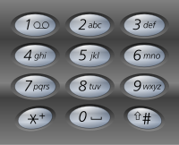

## 电话号码的字母组合

### 题目

给定一个仅包含数字 2-9 的字符串，返回所有它能表示的字母组合。

给出数字到字母的映射如下（与电话按键相同）。注意 1 不对应任何字母。



示例:
```
输入："23"
输出：["ad", "ae", "af", "bd", "be", "bf", "cd", "ce", "cf"].
```
说明:
尽管上面的答案是按字典序排列的，但是你可以任意选择答案输出的顺序。


### 解答

- 迭代

```javascript
var letterCombinations = function(digits) {
    const maps = {
        '2': ['a', 'b', 'c'],
        '3': ['d', 'e', 'f'],
        '4': ['g', 'h', 'i'],
        '5': ['j', 'k', 'l'],
        '6': ['m', 'n', 'o'],
        '7': ['p', 'q', 'r', 's'],
        '8': ['t', 'u', 'v'],
        '9': ['w', 'x', 'y', 'z'],
    };
    const list = [];
    const len = digits.length;
    if (len < 1) return [];
    const getStrList = (i, temp) => {
        if (i === len) {
            list.push(temp);
            return;
        }
        maps[digits[i]].forEach(item => {
            getStrList(i+1, temp + item);
        })
    };
    getStrList(0, '');
    return list;
};
```

- 动态规划

```javascript
var letterCombinations = function(digits) {
    const maps = {
        '2': ['a', 'b', 'c'],
        '3': ['d', 'e', 'f'],
        '4': ['g', 'h', 'i'],
        '5': ['j', 'k', 'l'],
        '6': ['m', 'n', 'o'],
        '7': ['p', 'q', 'r', 's'],
        '8': ['t', 'u', 'v'],
        '9': ['w', 'x', 'y', 'z'],
    };
    const list = [];
    const len = digits.length;
    if (len < 1) return [];

    const dp = new Array(len);
    dp[0] = maps[digits[0]];
    for(let i = 1; i < len; i++) {
        dp[i] = [];
        dp[i - 1].forEach(str => {
            maps[digits[i]].forEach(ch => {
                dp[i].push(str + ch);
            });
        });
    };
    return dp[len - 1];
};
```

- 笛卡尔积：

```javascript
var letterCombinations = function(digits) {
    const maps = {
        '2': ['a', 'b', 'c'],
        '3': ['d', 'e', 'f'],
        '4': ['g', 'h', 'i'],
        '5': ['j', 'k', 'l'],
        '6': ['m', 'n', 'o'],
        '7': ['p', 'q', 'r', 's'],
        '8': ['t', 'u', 'v'],
        '9': ['w', 'x', 'y', 'z'],
    };
    const len = digits.length;
    if (len < 1) return [];
    
    return digits.split('').reduce((accumulator, curtValue) => {
        if (!accumulator) return maps[curtValue];

        const res = [];
        accumulator.forEach(tem => {
            maps[curtValue].forEach(ch => {
                res.push(tem + ch);
            });
        });
        return res;
    }, null);
};
```